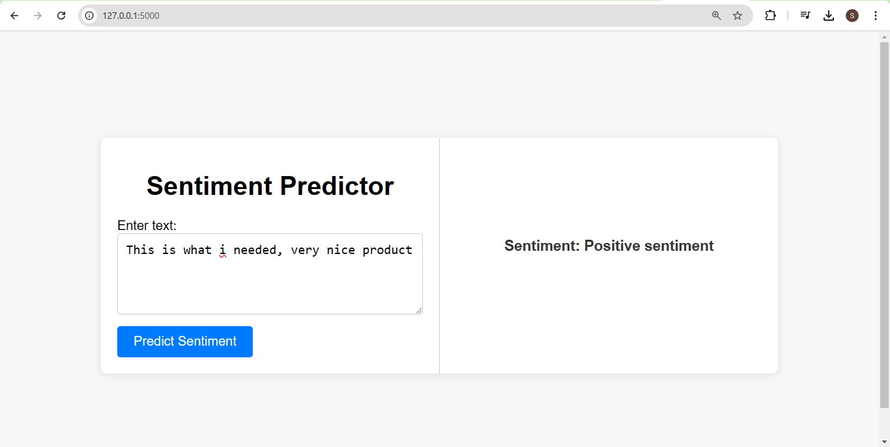
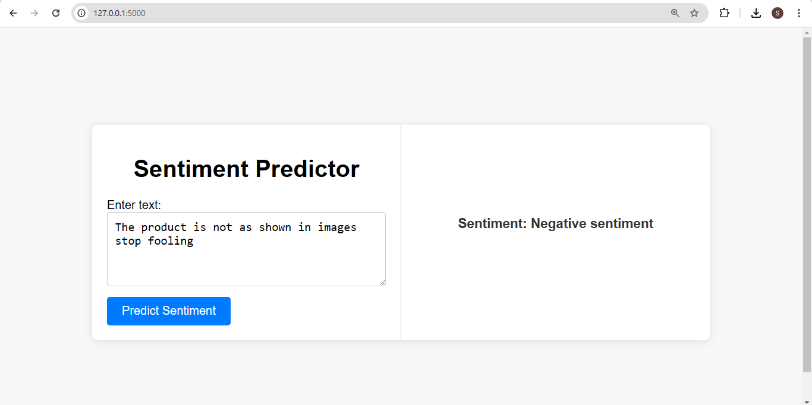

# Product-Reviews-Sentiment-Analysis
Sentiment analysis of product reviews, classifying them into positive, negative, and neutral categories. The model is trained using the BERT transformer and employs the BERT tokenizer for text preprocessing. The solution is integrated into a web-based application built with Flask for user interaction and deployment

### Download zip file of the model from here 





## To run the project
1. Clone the repo
```bash
git clone https://github.com/suzaankhan/Product-Reviews-Sentiment-Analysis
```
2. Download the BERT model and unzip it inside the project folder
3. Run app.py
